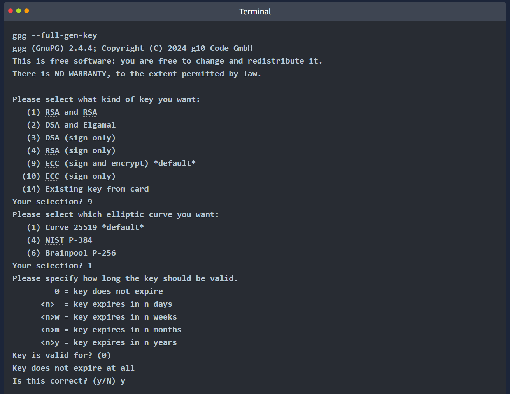
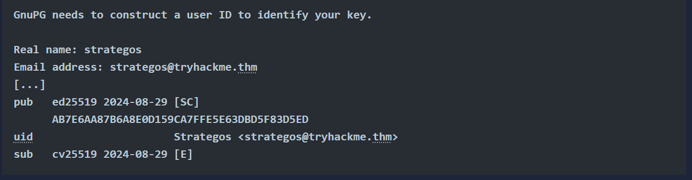

## PGP & GPG Overview

- **PGP (Pretty Good Privacy)** is software for encrypting files, signing messages, and protecting data.
- **GPG (GnuPG)** is the open-source version of PGP, following the OpenPGP standard.

### Uses

- Encrypt emails or files so only the intended recipient can read them.
- Sign emails or files to prove they really came from you and haven't been changed.

### Creating a GPG Key

1. Choose whether the key is for signing only or signing & encrypting.
2. Pick a cryptographic algorithm.
3. Set an expiry date for the key.
4. Provide your name, email, and a comment.

### Practical Example

- Share your public key with people so they can send you encrypted messages.
- Use your private key to decrypt messages.
- Keep a backup of your private key in a safe place.
- To move to a new computer:
  - Import your key with: `gpg --import backup.key`
  - Decrypt messages with: `gpg --decrypt confidential_message.gpg`

### Extra Info

- Private keys can be protected with a passphrase (like SSH keys).
- If passphrase-protected, tools like **John the Ripper** + **gpg2john** can attempt to crack it.
- The example key in this task does not have a passphrase.

### Task Questions

**Q:** Use GPG to decrypt the message in ~/Public-Crypto-Basics/Task-7. What secret word does the message hold?

**Answer:** Pineapple
