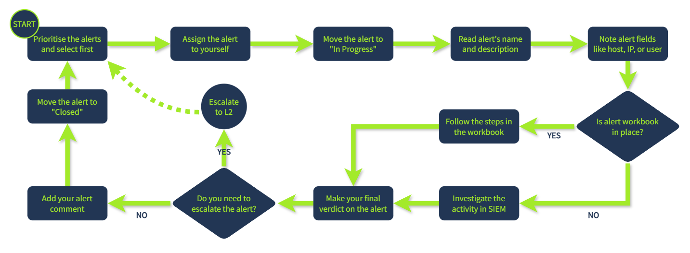
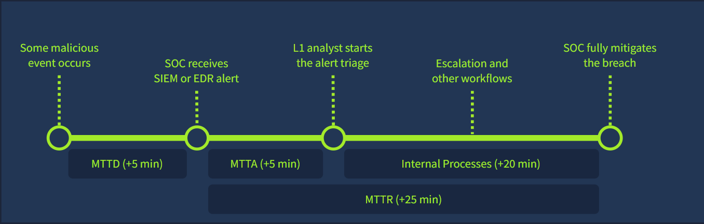

## How SOC team is involved in the alert triage:

- SOC L1 analysts
  - Review the alerts, distinguish bad from good, and notify L2 analysts in case of a real threat.
- SOC L2 analysts
  - Receive the alerts escalated by L1 analysts and perform deeper analysis and remediation.
- SOC engineers
  - Ensure the alerts contain enough information required for efficient alert triage.
- SOC manager
  - Track speed and quality of alert triage to ensure that real attacks won't be missed.

### Report format

- Who: Which user logs in, runs the command, or downloads the file.
- What: What exact action or event sequence was performed.
- When: When exactly did the suspicious activity start and ended.
- Where: Which device, IP, or website was involved in the alert.
- Why: The most important W, the reasoning for your final verdict.

### Escalate the alerts if:

- The alert is an indicator of a major cyberattack requiring deeper investigation or DFIR.
- Remediation actions like malware removal, host isolation, or password reset are required.
- Communication with customers, partners, management, or law enforcement agencies is required.
- You just do not fully understand the alert and need some help from more senior analysts.

--- 

## SOC Metrics and Objectives

### Core Metrics

- Alerts Count (AC)
  - Total Count of Alerts Received Overall load of SOC analysts.
  - 5 to 30 alerts per day per L1 analyst is a good metric.
- False Positive Rate (FPR)
  - False Positives / Total Alerts Level of noise in the alerts.
  - 0% is an unachievable ideal, but 80% or higher is a serious problem.
- Alert Escalation Rate (AER)
  - Escalated Alerts / Total Alerts Experience of L1 analysts.
  - aimed to be below 50%, or even better below 20%.
- Threat Detection Rate (TDR)
  - Detected Threats / Total Threats Reliability of the SOC team.
  - should always be at 100%.

### Triage Metrics

| Metric | Common SLA | Description |
| :--- | :---: | :--- |
| SOC Team Availability | 24/7 | Working schedule of the SOC team, often Monday-Friday (8/5) or 24/7 mode |
| Mean Time to Detect (MTTD) | 5 minutes | Average time between the attack and its detection by SOC tools |
| Mean Time to Acknowledge (MTTA) | 10 minutes | Average time for L1 analysts to start triage of the new alert |
| Mean Time to Respond (MTTR) | 60 minutes | Average time taken by SOC to actually stop the breach from spreading |

**Practice:**  Imagine a scenario where an employee was lured into running data stealer malware.
1. The SOC team received the "Connection to Redline Stealer C2" alert after 12 minutes.
2. One of the L1 analysts on shift moved the alert to In Progress 10 minutes later. 
3. After 6 minutes, the alert was escalated to L2, who spent 35 minutes cleaning the malware. 

Answer:
- MTTD = 12 min
- MTTA = 10 min
- MTTR = 10 + 6 + 35 = 51 min
