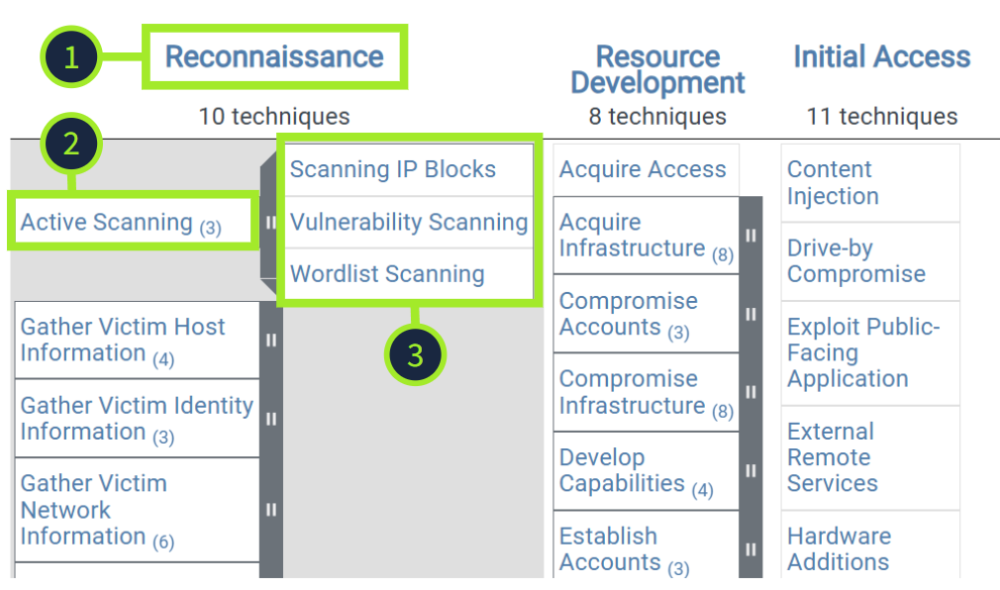
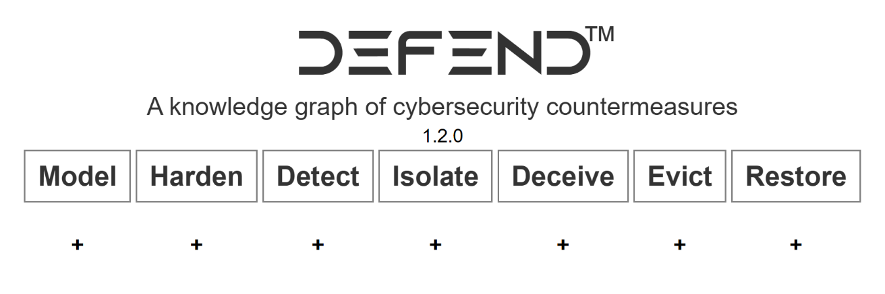

## MITRE ATT&CK

- A globally-accessible knowledge base of adversary tactics and techniques based on real-world observations.
- [https://attack.mitre.org/](https://attack.mitre.org/)

**ATT&CK Matrix**

- **Tactic**: Let's say that an attacker wants to perform Reconnaissance on their target. This is the attacker's goal.
- **Technique**: They may utilize the Active Scanning technique. This is how they achieve their Reconnaissance goal.
- **Sub-technique**: Active Scanning comprises three specific methods: Scanning IP Blocks, Vulnerability Scanning, or Wordlist Scanning.

## MITRE D3FEND

Detection, Denial, and Disruption Framework Empowering Network Defense

- With MITRE ATT&CK, you learn how attacks happen, but with MITRE D3FEND, you discover how to stop them.
- [https://d3fend.mitre.org/](https://d3fend.mitre.org/)

**D3FEND Matrix**

## Other MITRE Projects

**Emulation Plans**

[MITRE's Adversary Emulation Library](https://ctid.mitre.org/resources/adversary-emulation-library/)

- Primarily maintained and contributed to by The Center for Threat Informed Defense (CTID), is a free resource of adversary emulation plans. The library currently contains several emulations that mimic real-world attacks by known threat groups. The emulation plans are a step-by-step guide on how to mimic the specific threat group.

**Automated Adversary Emulation Tools**

[Caldera](https://caldera.mitre.org/)

- An automated adversary emulation tool designed to help security teams test and enhance their defenses. It provides the ability to simulate real-world attacker behavior utilizing the ATT&CK framework. This allows defenders to evaluate detection methods and practice incident response in a controlled environment. Caldera supports offensive and defensive operations, making it a powerful tool for red and blue team exercises.

**New and Emerging Frameworks**

[AADAPT (Adversarial Actions in Digital Asset Payment Technologies)](https://aadapt.mitre.org/)

- A newly released knowledge base that includes its own matrix, covering adversary tactics and techniques related to digital asset management systems. AADAPT follows a similar structure to the ATT&CK Framework we covered previously and aims to help defenders understand and mitigate threats targeting blockchain networks, smart contracts, digital wallets, and other digital asset technologies.

[ATLAS (Adversarial Threat Landscape for Artificial-Intelligence Systems)](https://atlas.mitre.org/)

- A knowledge base and framework that includes a matrix, focusing on threats targeting artificial intelligence and machine learning systems. It documents real-world attack techniques, vulnerabilities, and mitigations specific to AI technology.
