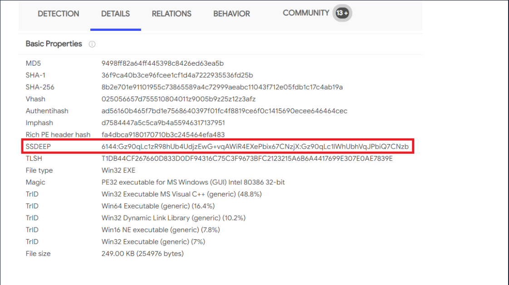

## Pyramid Of Pain

Utilize this model to determine the level of difficulty it will cause for an adversary to change the indicators associated with them, and their campaign.

- Hash Values (Trivial)
- IP Address (Easy)
- Domain Names (Simple)
- Host Artifacts (Annoying)
- Network Artifacts (Annoying)
- Tools (Challenging)
- TTPs (Tough)

#### Domain Names (Simple)

**Punycode**

Example:

- legitimate: adidas.de
- adıdas.de = Punycode of http://xn--addas-o4a.de/

**URL shorteners**

Appending "+" to the shortened link will display the actual website it is redirecting you to.

#### Host Artifacts (Annoying)

Host artifacts are the traces or observables that attackers leave on the system, such as registry values, suspicious process execution, attack patterns or IOCs (Indicators of Compromise), files dropped by malicious applications, or anything exclusive to the current threat.

#### Network Artifacts (Annoying)

A network artifact is something unusual you can observe in network traffic.

Examples:

- User-Agent strings (what a browser or program says it is)
- Command-and-Control (C2) server details
- Strange URI or URL patterns, especially in HTTP POST requests

Network artifacts can be detected in Wireshark PCAPs (file that contains the packet data of a network) by using a network protocol analyzer such as _TShark_ or exploring IDS (Intrusion Detection System) logging from a source such as _Snort_.

#### Tools (Challenging)

Antivirus signatures, detection rules, and YARA rules can be great weapons for you to use against attackers at this stage.

Fuzzy hashing helps you to perform similarity analysis - match two files with minor differences based on the fuzzy hash values. This lets you compare two signatures and get a similarity score (0-100%). One of the examples of fuzzy hashing is the usage of SSDeep.

#### TTPs (Tough)

Tactics, Techniques & Procedures. This includes the whole MITRE ATT&CK Matrix, which means all the steps taken by an adversary to achieve his goal.
