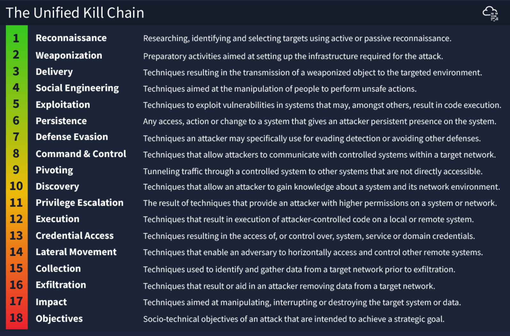
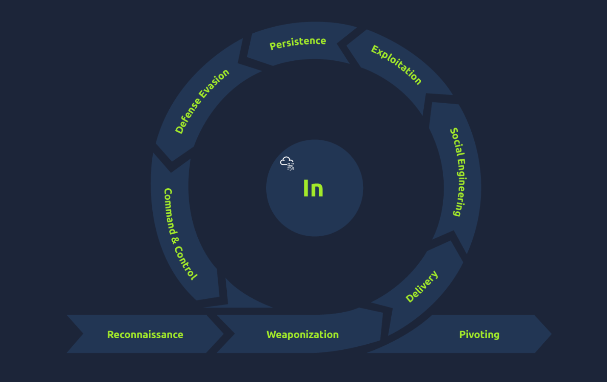
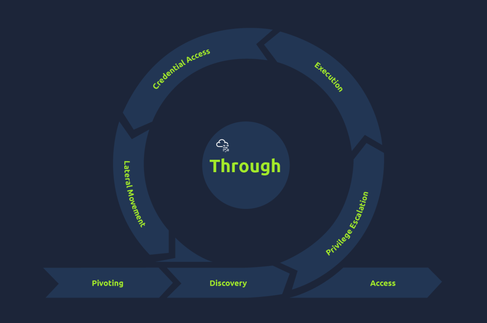

# Unified Kill Chain (UKC)

- Covers an entire attack - from reconnaissance, exploitation, post-exploitation and includes identifying an attacker's motivation.
- Highlights a much more realistic attack scenario. Various stages will often re-occur.
  - For example, after exploiting a machine, an attacker will begin reconnaissance to pivot another system.
- Released in 2017, updated in 2022 (Modern)

---

### Phase: In (Initial Foothold)

The main focus of this series of phases is for an attacker to gain access to a system or networked environment.

- Reconnaissance (MITRE Tactic TA0043)
- Weaponization (MITRE Tactic TA0001)
- Social Engineering (MITRE Tactic TA0001)
- Exploitation (MITRE Tactic TA0002)
- Persistence (MITRE Tactic TA0003)
- Defence Evasion (MITRE Tactic TA0005)
- Command & Control (MITRE Tactic TA0011)
- Pivoting (MITRE Tactic TA0008)

---

### Phase: Through (Network Propagation)

An attacker would seek to gain additional access and privileges to systems and data to fulfil their goals. The attacker would set up a base on one of the systems to act as their pivot point and use it to gather information about the internal network.

- Pivoting (MITRE Tactic TA0008)
- Discovery (MITRE Tactic TA0007)
- Privilege Escalation (MITRE Tactic TA0004)
- Execution (MITRE Tactic TA0002)
- Credential Access (MITRE Tactic TA0006)
- Lateral Movement (MITRE Tactic TA0008)

---

### Phase: Out (Action on Objectives)

This phase wraps up the journey of an adversary’s attack on an environment, where they have critical asset access and can fulfil their attack goals. These goals are usually geared toward compromising the confidentiality, integrity and availability (CIA) triad.

- Collection MITRE Tactic (TA0009)
- Exfiltration (MITRE Tactic TA0010)
- Impact (MITRE Tactic TA0040)
- Objectives

For example, if the attack was financially motivated, they may seek to encrypt files and systems with ransomware and ask for payment to release the data. In other instances, the attacker may seek to damage the reputation of the business, and they would release private and confidential information to the public.
