# Elastic Stack (ELK)

## Core Components

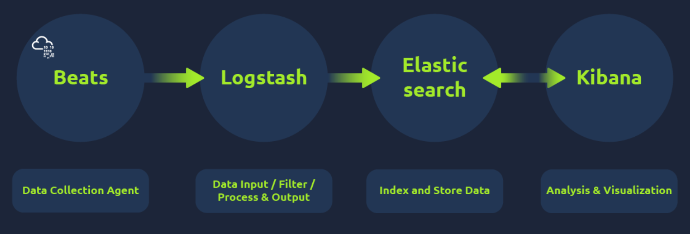

**Beats**: collect data from multiple agents.

- Each beat is a single-purpose agent that sends specific data to Elasticsearch.

**Logstash**: collects data from beats, ports, or files, parses/normalizes it into field value pairs, and stores them into Elasticsearch. A Logstash configuration file is divided into three parts:

- **Input**: where the user defines the source from which the data is being ingested.
- **Filter**: where the user specifies the filter options to normalize the log ingested above.
- **Output**: where the user wants the filtered data to be sent. It can be a listening port, Kibana Interface, Elasticsearch database, or file.

**Elasticsearch**: acts as a database used to search and analyze data.

- A full-text search and analytics engine for JSON-formatted documents.
- Stores, analyzes, and correlates data and supports a RESTful API for interacting with it.

**Kibana**: responsible for displaying and visualizing the data stored in Elasticsearch.

- Web-based data visualization tool that works with Elasticsearch.

## KQL (Kibana Query Language)

**Free text Search**: allows users to search for logs based on text only.

- Whole term search, e.g. `"United States"`
- With wildcard, e.g. `"United*"`
- With Logical Operators (AND | OR | NOT), e.g. `"United States" AND "Virginia"`, `"United States" AND NOT ("Florida")`

**Field-based search**: use `Field: Value` to search for logs

- e.g. `Source_ip : 238.163.231.224 AND UserName : Suleman`

## Practice Questions

### Discovery Tab

1. Which user is responsible for the overall maximum traffic?
   Answer: James
   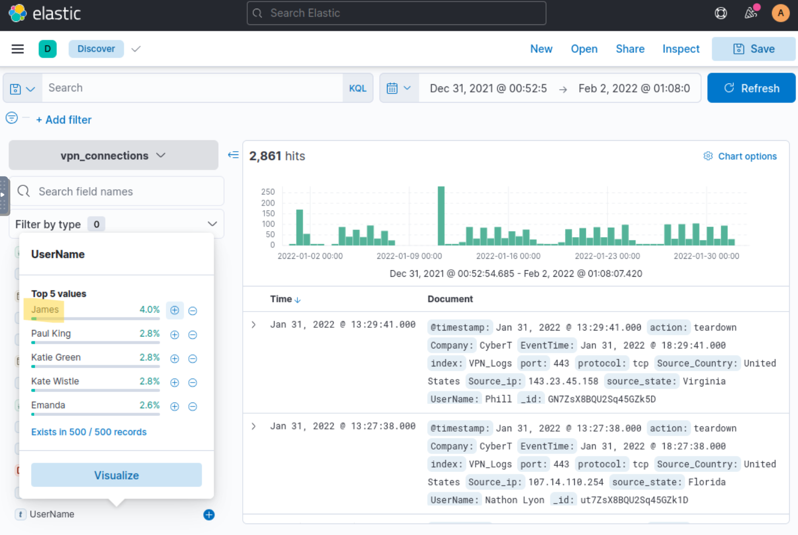

2. Apply Filter on UserName Emanda; which SourceIP has max hits?
   Answer: 107.14.1.247
   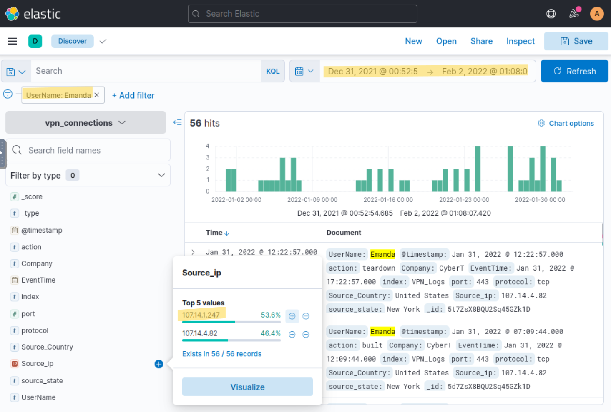

3. On 11th Jan, which IP caused the spike observed in the time chart?
   Answer: 172.201.60.191
   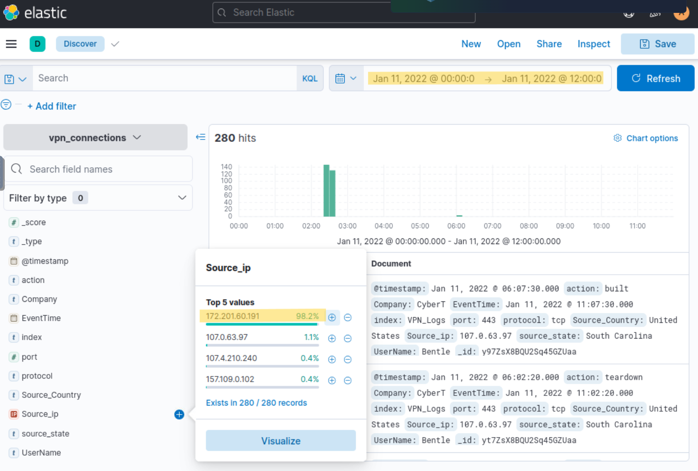

4. How many connections were observed from IP 238.163.231.224, excluding the New York state?
   Answer: 48
   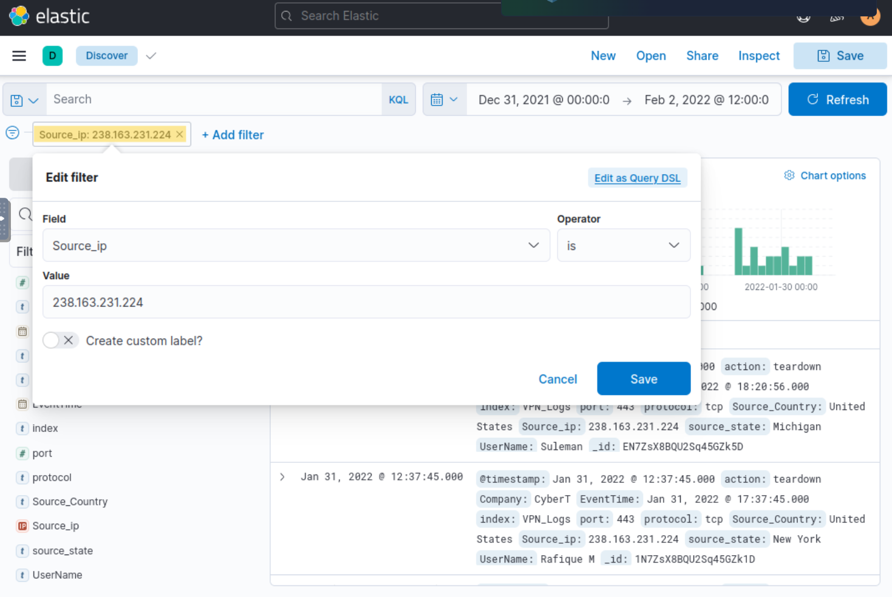
   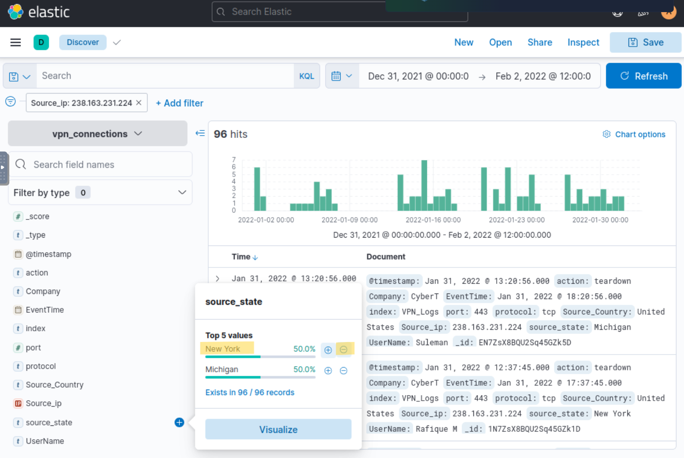
   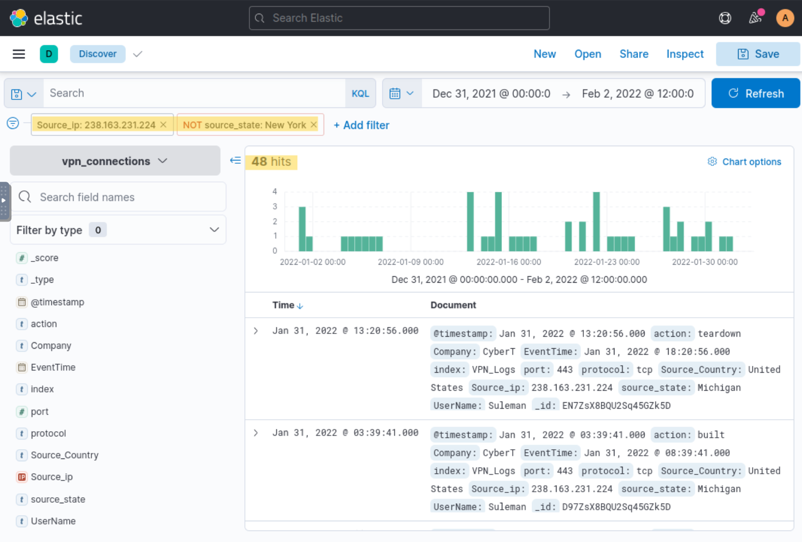

5. Create a table with the fields IP, UserName, Source_Country and save.
   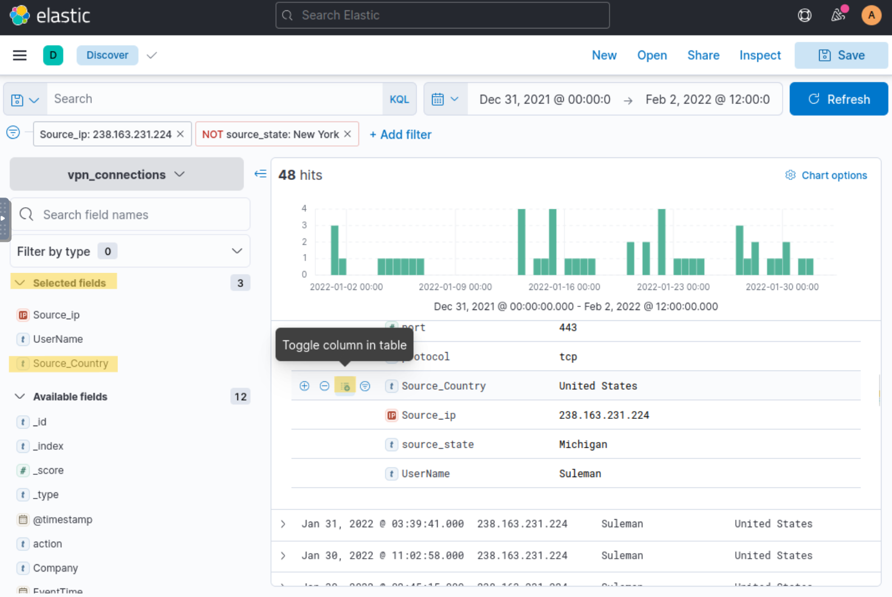

### KQL

1. Create a search query to filter the logs where Source_Country is the United States and show logs from User James or Albert. How many records were returned?
Answer: 161
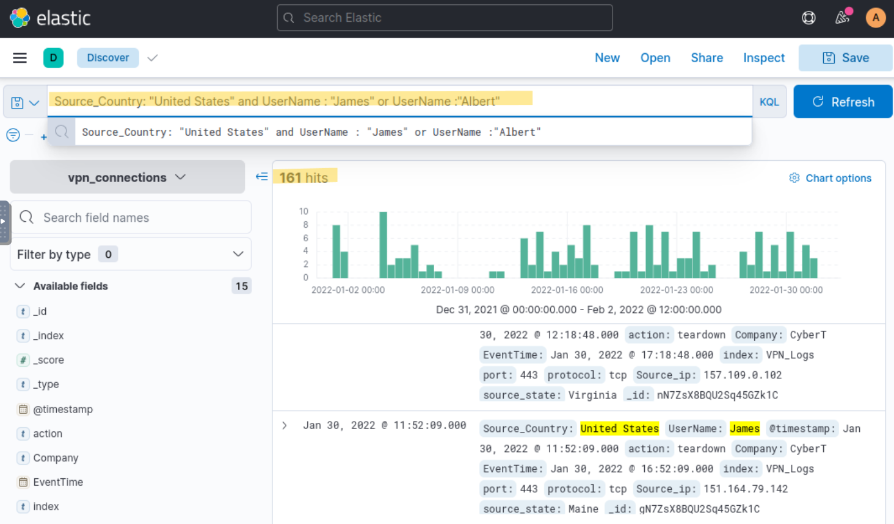

```kql
Source_Country: "United States" and UserName : "James" or UserName :"Albert"
```


2. A user Johny Brown was terminated on the 1st of January, 2022. Create a search query to determine how many times a VPN connection was observed after his termination.
   Answer: 1
   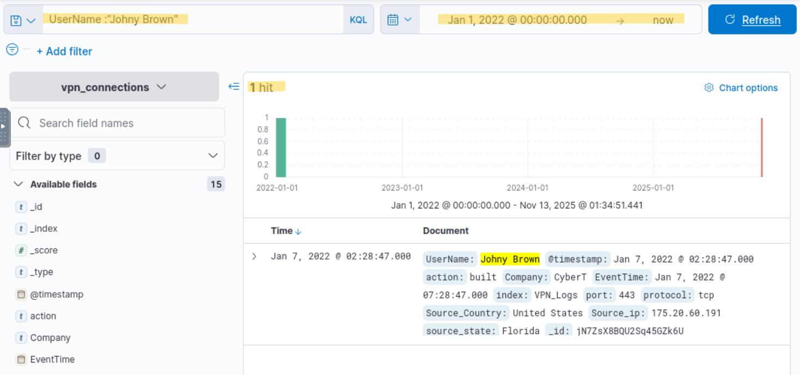

### Creating Visualization

Create a table to show the user and the IP address involved in failed attempts.

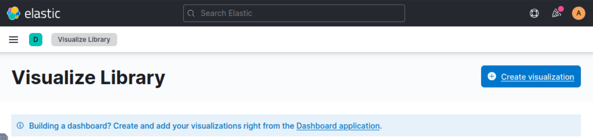
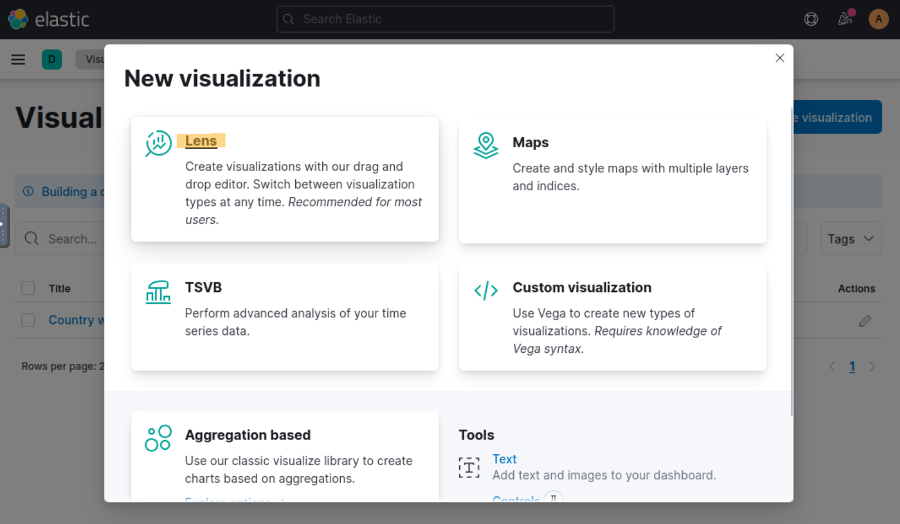

1. Which user was observed with the greatest number of failed attempts?
   Answer: Simon
   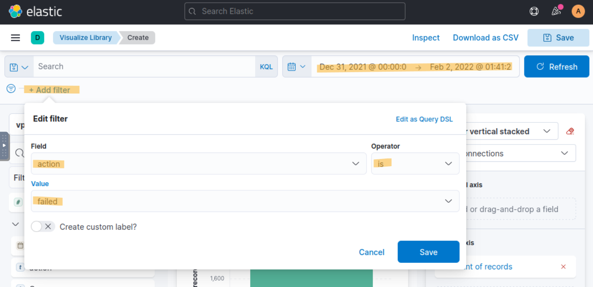
   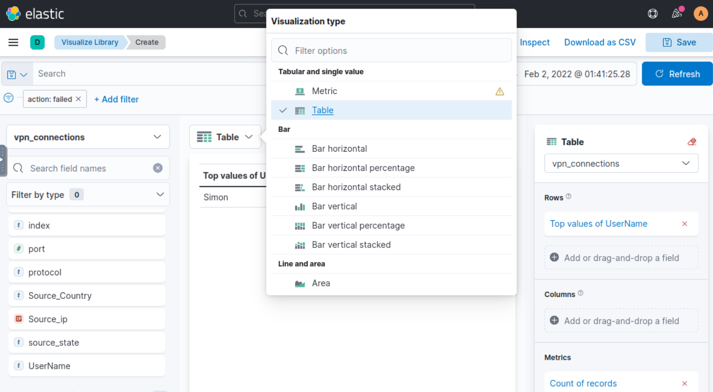
   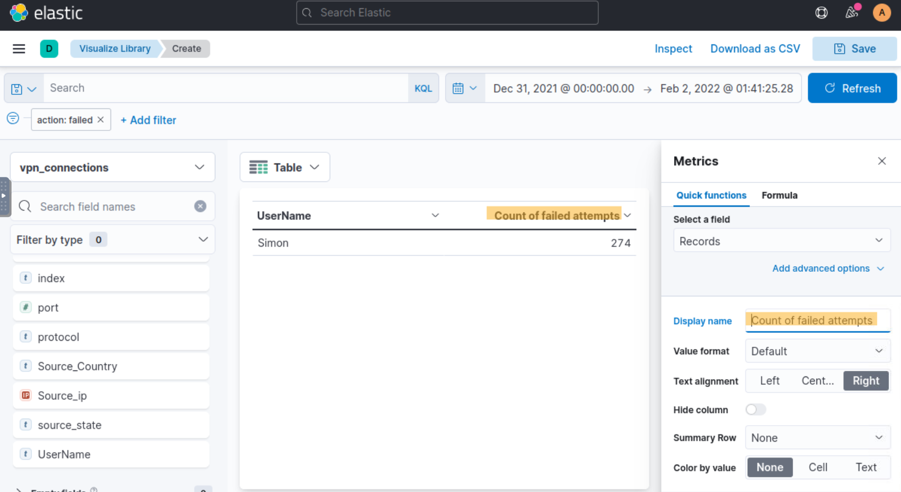

2. How many wrong VPN connection attempts were observed in January?
   Answer: 274
   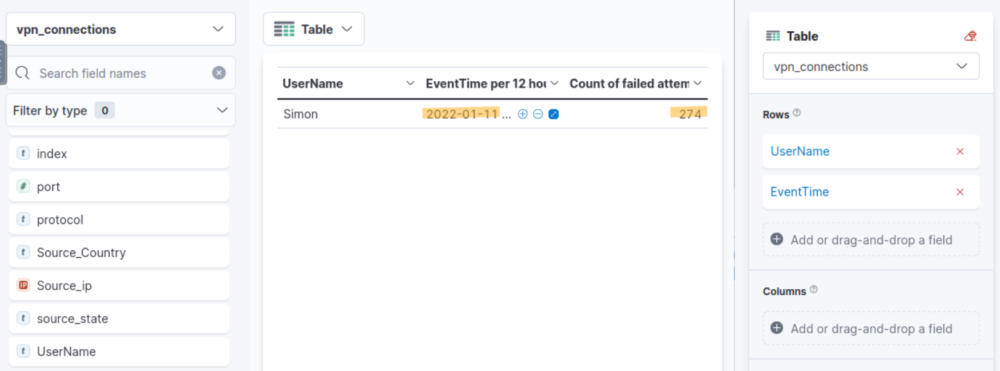
