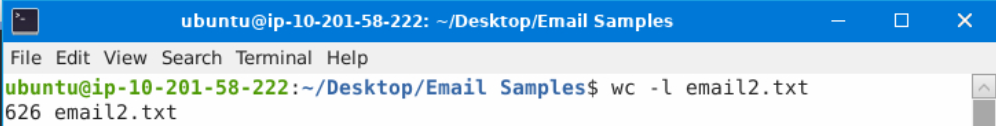
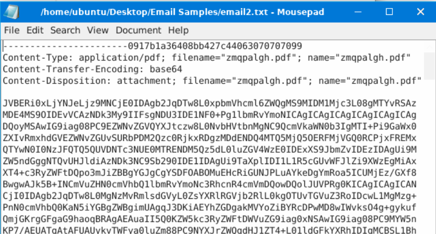
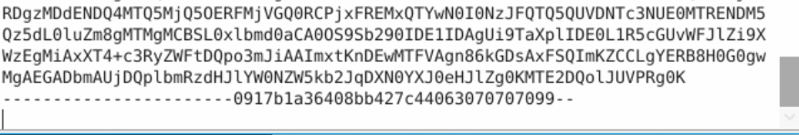
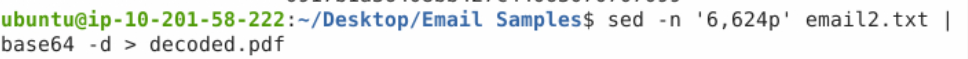
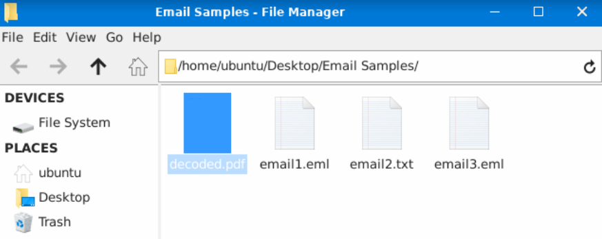
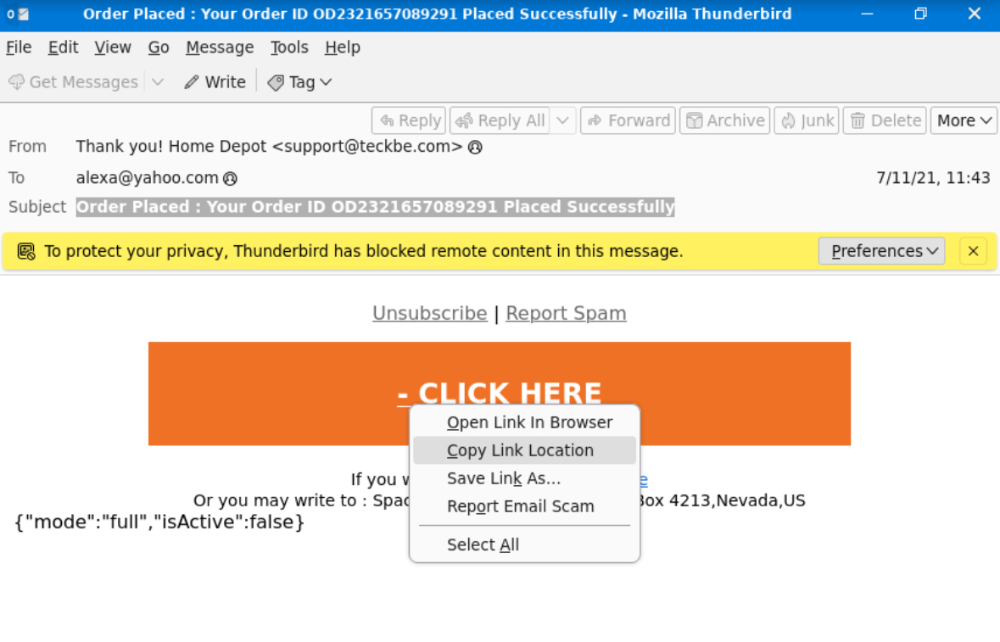
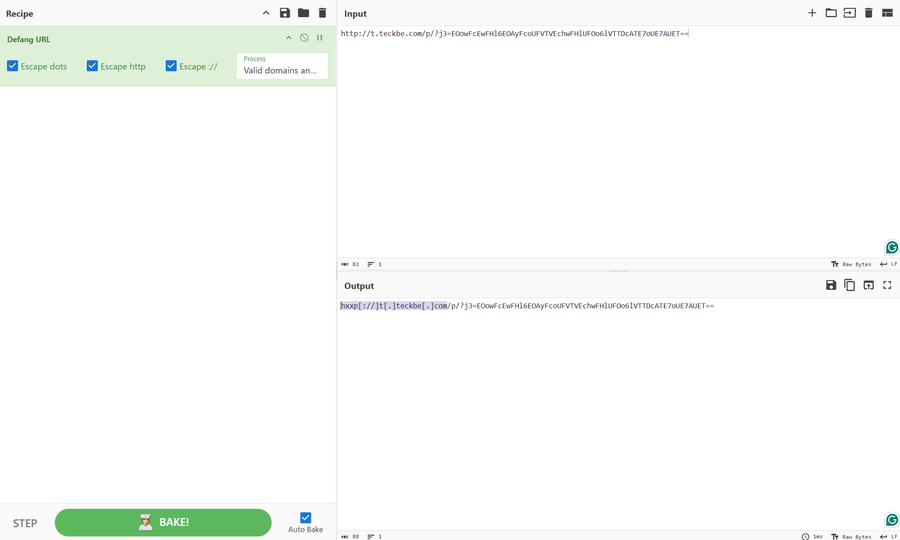

# Phishing Analysis

## Practice Questions

**Q: In the attached virtual machine, view the information in email2.txt and reconstruct the PDF using the base64 data. What is the text within the PDF?**

Check the line count.

Check the file content.

...

Grab the base64 part to parse from. The part starts from line 6 and ends on line 624.

Open the reconstructed PDF to view the flag.

Answer: THM{not disclosing here}

**Q: What is the website for the - CLICK HERE URL in a defanged format? (e.g. https://website.thm)**

Grab the link

Use **Cyber Chef** (https://gchq.github.io/CyberChef/) to obtain the defanged URL.

Answer: hxxp[://]t[.]teckbe[.]com
