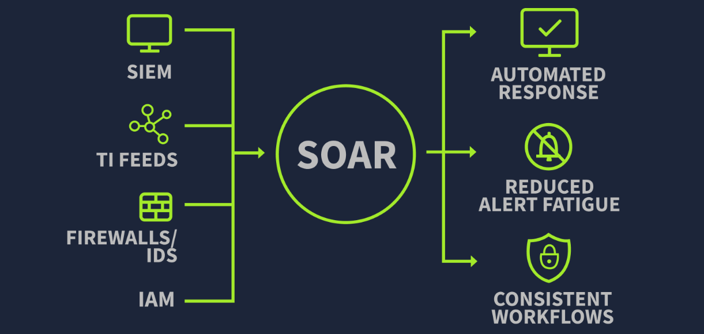

# SOAR

Security Orchestration, Automation, and Response

### Orchestration

Traditionally, during a VPN brute force, the analyst typically switches between the following tools:

- SIEM to check if the user usually uses the subject IP for logging
- Threat Intelligence (TI) platforms to verify the IP's reputation
- IAM tool to disable the user if there was any successful attempt
- Ticketing system to open and track the incident

This manual switching between different tools slows down the process. Orchestration solves this problem by coordinating all these tools together inside the SOAR.

For example, with a playbook:

- Received alert from SIEM
- Query SIEM to check if the User normally uses the IP
- Check TI platforms for the IP's reputation
- Query SIEM for any successful logins
- Escalate to containment actions

These playbooks are dynamic and usually contain different paths. The result of each step determines the next action.

### Automation

Predefined actions (Playbooks) can be automated. Automation means no more manual clicks needed from SOC analysts. SOAR will itself follow the playbooks.

Let's resume the playbook for VPN brute force alert combined with the Automation.

- SOAR receives the alert from SIEM
- It automatically queries the SIEM for the user's historical logins
- It automatically verifies the IP's reputation through TI platforms
- If the IP is malicious, it automatically disables the user from the IAM
- Lastly, it automatically opens a ticket in the ticketing system with all the details to initiate an investigation

This saves a tremendous amount of time for SOC analysts.

### Response

SOAR also automates the response.

For example, SOAR can follow the playbook of VPN Brute force and block the IP on the firewall, disable the user in the IAM, and open a ticket with all the details.
