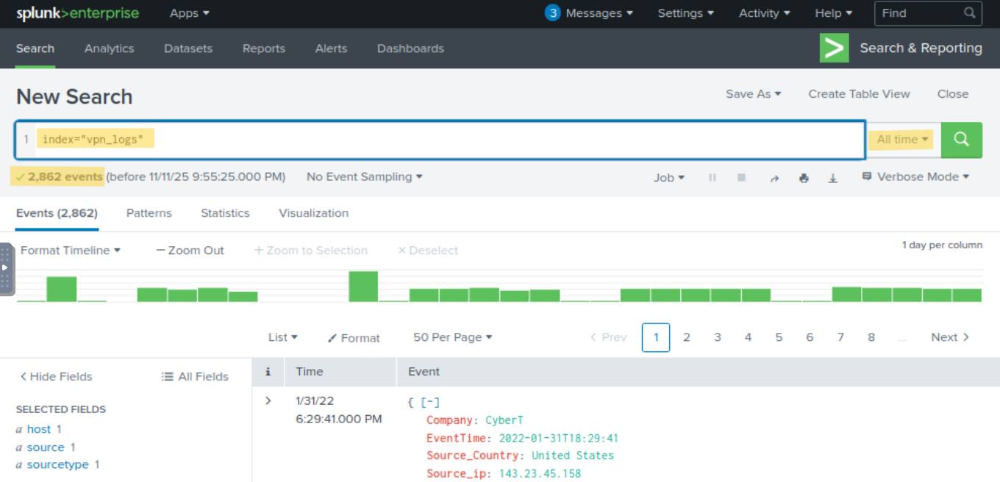
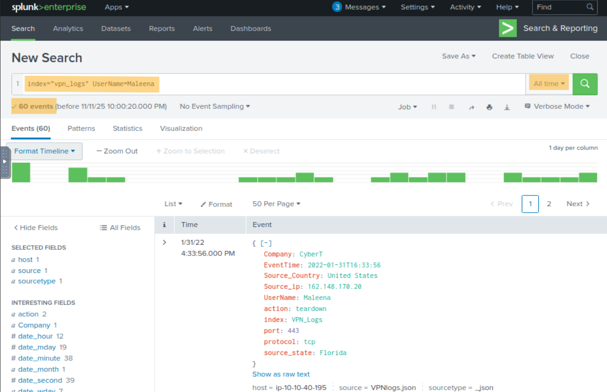
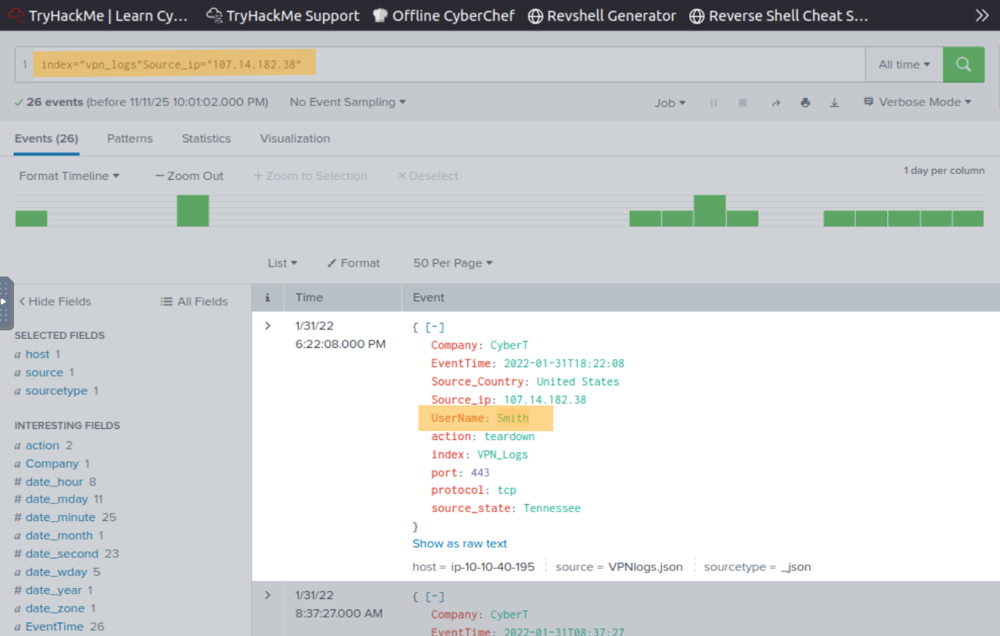
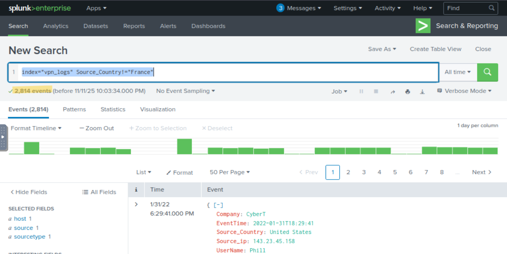
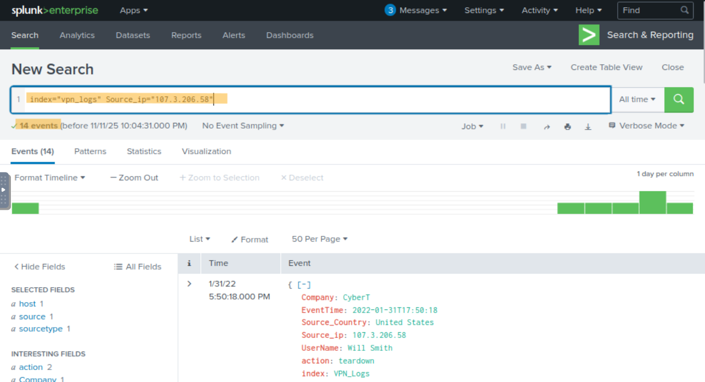

# Splunk

## Components

Forwarder

- Collect the data and send it to the Splunk instance.
- Does **not** affect the endpoint's performance as it takes a few resources to process.

Indexer

- Parses and **normalizes** the data into **field-value pairs**, categorizes it, and stores the results as events.

Search Head

- Within the **Search & Reporting App** and is the interface where users run **SPL queries** to retrieve and analyze indexed data from the indexers.
- Allows you to transform results into presentable tables and visualizations

### Practice Questions

1. Upload the data attached to this task and create an index "VPN_Logs". How many events are present in the log file?

```splunk
index="vpn_logs"
```



2. How many log events are captured by the user Maleena?

```splunk
index="vpn_logs" UserName="Maleena"
```



3. What is the username associated with IP 107.14.182.38?

```splunk
index="vpn_logs" Source_ip="107.14.182.38"
```



4. What is the number of events that originated from all countries except France?

```splunk
index="vpn_logs" Source_Country!="France"
```



5. How many VPN events were associated with the IP 107.3.206.58?

```splunk
index="vpn_logs" Source_ip="107.3.206.58"
```


